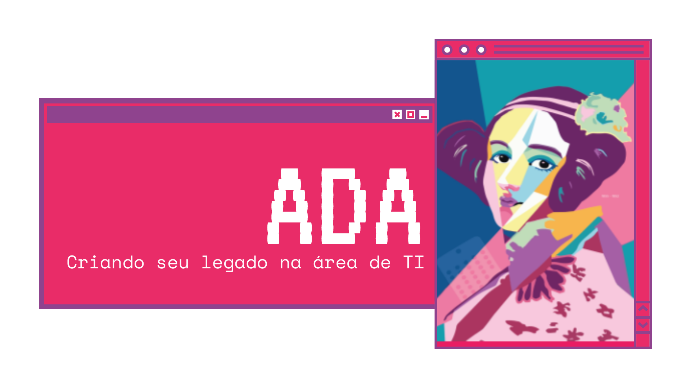

 
 

<h1 align="center">
  

 
</h1>

> A *ADA* tem a proposta de conectar minas e meninas que tem interesse na área de tecnologia com oficinas e cursos feitos por mulheres para mulheres. 

> Status: **Pronto para o lançamento** 🚀

## **Apresentação**

A *ADA - Aprenda DelAs* é o projeto de conclusão do bootcamp de Back-end da [{reprograma}](https://reprograma.com.br/), em parceria com o [projeto MINAs do Porto Digital](https://www.portodigital.org/capital-humano/iniciativas-para-a-diversidade/mulheres-em-inovacao-negocios-e-artes-minas). 

 A API *ADA* faz parte de um projeto maior que atualmente está participanda da incubação [Mind The Minas](https://forbes.com.br/tag/mind-the-minas/) do Porto Digital. 
 
 Esta API é um banco de dados de cursos, oficinas e comunidades feito por mulheres para mulheres que tem como objetivo conectar minas com oportunidades na área de tecnologia e formentar a participação feminina no mercado, *criando assim seus legado na área de TI*. 

## **Contextualização**

A ideia surgiu quando me deparei com essa notícia, segundo Associação Brasileira de Empresas de Software (ABES) no setor de TI brasileiro são criadas **70 mil novas vagas por ano**. E durante a pandemia houve um aumento de 1,2% nesse número chegando a 84 mil novas vagas apenas no ano de 2020.
Segundo IBGE, existem 580 mil profissionais de TI no Brasil, porém apenas **20% dessas vagas são ocupadas por mulheres**. Outra pesquisa realizada no Brasil e divulgada pela ONU Mulheres diz que apenas 17% dos estudantes de programação são mulheres. 
De acordo com esses dados foi feita uma pesquisa com 175 meninas e mulheres, onde perguntamos: **Porque tão poucas mulheres na área de TI?**
Os dados revelaram que 57% das entrevistadas sentem falta de orientação ou informações e 89% acreditam que tecnologia não é para elas. Outras dores também foram levantadas como dificuldade em matemática, ambiente muito masculino e falta de representatividade. 

## **Fonte dos dados**
- [CNN Brasil Business](https://www.cnnbrasil.com.br/business/2020/09/11/vagas-em-ti-aumentam-1-2-na-pandemia-e-sao-necessarias-mais-de-70-mil-pessoas)
- [ONU Mulheres](http://www.onumulheres.org.br/areas-tematicas/empoderamento-economico/)
- [IBGE](https://www.ibge.gov.br/)
- [Progra{m}aria](https://www.programaria.org/inspirar-mais-representatividade-e-estimulo-para-aumentar-a-presenca-de-mulheres-na-tecnologia/)

## **Funcionalidades**

#### **Para os cursos**

:heavy_check_mark: Cadastro de novos cursos

:heavy_check_mark: Listar todos os cursos

:heavy_check_mark: Atualizar um curso específico

:heavy_check_mark: Remover um curso específico do banco de dados

:heavy_check_mark: Visualizar cursos por categoria (Ex:Bootcamp, Workshop, Graduação)

:heavy_check_mark: Visualizar cursos por área (Ex: FrontEnd, BackEnd, Dados, Mobile, Infra)

:heavy_check_mark: Visualizar cursos por comunidade

:heavy_check_mark: Visualizar cursos por nível 
  - Exploradora: primeiros passos em tecnologia
  - Mergulhadora: mergulha em área de interesse
  - Astronauta: voando para o mercado
  
:heavy_check_mark: Visualizar cursos por forma de pagamento

:heavy_check_mark: Visualizar curso por nível e forma de pagamento

#### **Para as usuárias**
:heavy_check_mark: Login como usuária

:heavy_check_mark: Cadastrar nova usuária

:heavy_check_mark: Listar todas as usuárias

:heavy_check_mark: Atualizar dados de uma usuária específica

:heavy_check_mark: Remover cadastro de uma usuária específica

:heavy_check_mark: Filtrar cadastro de uma usuária específica

:heavy_check_mark: Filtrar usuárias por área (Ex: FrontEnd, BackEnd, Dados, Mobile, Infra)

:heavy_check_mark: Filtrar usuárias por nível 
  - Exploradora: primeiros passos em tecnologia
  - Mergulhadora: mergulha em área de interesse
  - Astronauta: voando para o mercado
  
:heavy_check_mark: Editar nível de uma usuária específica

## **Tecnologias**

- Controle de versões 
- Editor de código - IDE 
- Desenvolver o back-end em Javascript 
- Framework JavaScript 
- Gerenciador de pacotes 
-   Running tests local 
- Pesquisar banco de dados localmente 
- Hospedagem do banco de dados na nuvem 
- Deploy da aplicação na web
- Dependências para autenticação  
- Bibliotecas  

## **Features e rotas**

Esta API está sendo escutada na `porta 8080` e para que todas as rotas possam ser acessadas localmente é necessário usar `http://localhost:8080/` antes dos endpoints de requisição.
Haverá duas entidades na inserção de dados:

### **Manipulando os registros de cursos**
| Feature                                                      | Método | Rota                        |
| ------------------------------------------------------------ | ------ | --------------------------- |
| Cadastrar um curso                                          | POST   | /courses                      |
| Listar todos os cursos cadastrados                    | GET    | /courses                     |
| Pesquisar cursos por categoria (Bootcamp, Workshop, Graduação)  | GET    | /courses/type                     |
| Pesquisar cursos por área (FrontEnd, BackEnd, Dados, Mobile, Infra)          | GET    | /courses/field   |
| Pesquisar cursos por comunidade | GET    | /courses/community                 |
| Pesquisar cursos por forma de pagamento | GET    | /courses/free                 |
| Pesquisar cursos por  nível(exploradora,mergulhadora,astronauta)  | GET    | /courses/level                |
| Pesquisar cursos por  nível  e forma de pagamento| GET    | /courses/levelfree                |
| Editar o registro completo de um curso, buscando pelo Id     | PUT    | /courses/:id                  |
| Excluir registro de um curso pelo Id  | DELETE | /courses/:id                  |

### **Manipulando os registros de usuárias**

| Feature                                                 | Método | Rota                                     |
| ------------------------------------------------------- | ------ | ---------------------------------------- |
| Cadastrar nova usuária | POST   | /users                         |
| Login como usuária                | POST    | /users/login                         |
| Listar todas as usuárias              | GET    | /users |
| Filtrar cadastro de uma usuária específica pelo Id | GET    | /users/:id          |
| Filtrar usuárias por área (FrontEnd, BackEnd, Dados, Mobile, Infra)                              | GET    | users/field                   |
| Filtrar usuárias por nível(exploradora,mergulhadora,astronauta)                     | GET   | /users/level                     |
| Editar nível de uma usuária, buscando pelo id       | PATCH  | /users/:id                         |
| Atualizar dados de uma usuária específica                         | PUT | /users/:id                      |
| Remover cadastro de uma usuária específica                      | DELETE | /users/:id               |

## **Instalação e Contribuição no projeto** 

1. Faça um **fork** do projeto.
2. Realize o clone do projeto através do `git clone <link_do_fork_do_repositorio>`
3. Crie uma nova branch com as suas alterações: `git checkout -b my-feature`
4. Instale as dependências necessárias à execução da API através do comando `npm install`
5. Salve as alterações e crie uma mensagem de commit contando o que você fez: `git commit -m "feature: My new feature"`
6. Envie as suas alterações: `git push origin my-feature`

> Caso tenha alguma dúvida confira este [guia de como contribuir no GitHub](https://github.com/firstcontributions/first-contributions)

## **Referências**

- [Informações para licenças](http://escolhaumalicenca.com.br/licencas/mit/#) 
- [Lista com emojis](https://gist.github.com/rxaviers/7360908)
- [{reprograma} - Projeto Final](https://github.com/reprograma/on7-porto-s17-s18-projeto-livre)

## **Agradecimentos**

A palavra e o sentimento é **GRATIDÃO**:

Ao Reprograma juntamente com o Porto Digital Minas por me proporcionar essa experiência de aprendizado e empoderamento;
A turma On-7 pela sororidade, empatia, companheirismo e ajuda durante essa jornada. Sem dúvida, o melhor grupo de mulheres(guerreiras) que já conheci na vida,verdadeiras inspirações;
A nossa facilitadora Raíssa, que acreditou em mim antes mesmo do curso e incentivou em cada passo;
As nossas professoras, monitoras e orientadoras que sempre estavam presente para ajudar;
A minha família pela compreensão nos domingos que não estive presente e por me apoiarem mesmo sem entender o "que tanto faço nesse computador". 

## **Licença**

Este projeto está sob a licença [MIT](./LICENSE.md).

---

Developed with 💜 by  <b>Jessica Montenegro</b>  :computer:

 
 

Entre em contato   

 
 

